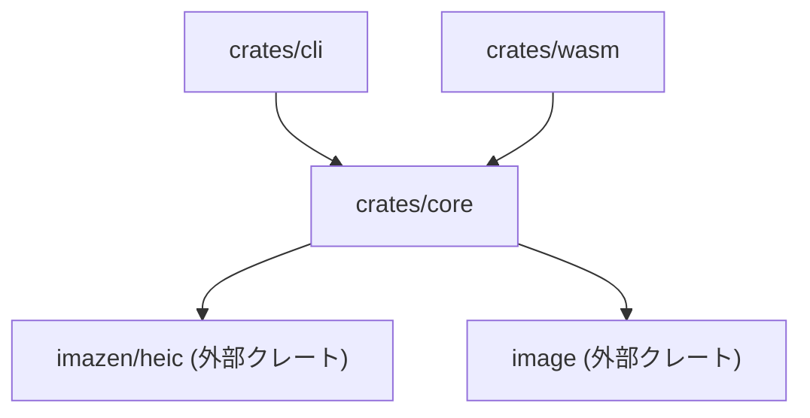
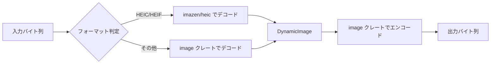

# 仕様

## 1. 概要

`image-converter-rs` は、純粋 Rust 実装の HEIC デコーダ [`imazen/heic`](https://github.com/imazen/heic) をコアに採用した、高速かつポータブルな画像変換ツールである。

C 言語の外部ライブラリ（`libheif` 等）に依存しないため、クロスコンパイルが容易であり、**CLI・WebAssembly（Bundler/Node.js・ブラウザ）** の各環境で同一コードベースから動作する。

---

## 2. ゴール

| # | ゴール |
|---|--------|
| G1 | HEIC/HEIF を含む主要画像フォーマットを相互変換できること |
| G2 | CLI でファイル単位の変換ができること |
| G3 | Wasm (Bundler/Node.js) として npm パッケージで利用できること |
| G4 | Wasm Web としてブラウザ上でクライアントサイド変換ができること |
| G5 | 外部 C ライブラリへの依存を持たないこと（Pure Rust） |

---

## 3. 対応フォーマット

### 3.1 入力フォーマット

| フォーマット | 拡張子 | デコーダ |
|-------------|--------|---------|
| HEIC / HEIF | `.heic`, `.heif` | `imazen/heic` |
| JPEG | `.jpg`, `.jpeg` | `image` クレート |
| PNG | `.png` | `image` クレート |
| WebP | `.webp` | `image` クレート |
| BMP | `.bmp` | `image` クレート |
| TIFF | `.tif`, `.tiff` | `image` クレート |
| GIF | `.gif` | `image` クレート |

> [!NOTE]
> `imazen/heic` は HEIC/HEIF のデコードのみを担当する。それ以外のフォーマットには [`image`](https://crates.io/crates/image) クレートを使用する。

### 3.2 出力フォーマット

| フォーマット | 拡張子 | エンコーダ |
|-------------|--------|-----------|
| JPEG | `.jpg`, `.jpeg` | `image` クレート |
| PNG | `.png` | `image` クレート |
| WebP | `.webp` | `image` クレート |
| BMP | `.bmp` | `image` クレート |
| TIFF | `.tif`, `.tiff` | `image` クレート |

> [!IMPORTANT]
> HEIC/HEIF への**エンコード（出力）は対象外**とする。`imazen/heic` がデコードのみをサポートしているため。

---

## 4. アーキテクチャ

### 4.1 プロジェクト構成

Cargo ワークスペースにより、コアロジックと各インターフェースを分離する。

```text
image-converter-rs/
├── Cargo.toml              # ワークスペースルート
├── crates/
│   ├── core/               # 共通の変換ロジック
│   │   ├── Cargo.toml
│   │   └── src/
│   │       └── lib.rs
│   ├── cli/                # CLI インターフェース
│   │   ├── Cargo.toml
│   │   └── src/
│   │       └── main.rs
│   └── wasm/               # WebAssembly インターフェース
│       ├── Cargo.toml
│       └── src/
│           └── lib.rs
├── examples/               # Wasm Web デモページ
│   ├── index.html
│   └── index.js
└── docs/
    └── specification.md    # 本仕様書
```

### 4.2 クレート依存関係



---

## 5. 各クレートの仕様

### 5.1 `core` クレート

画像変換のコアロジックを提供するライブラリクレート。CLI・Wasm の両方から利用される。

#### 5.1.1 公開 API（案）

```rust
/// 対応する出力フォーマット
pub enum OutputFormat {
    Jpeg,
    Png,
    WebP,
    Bmp,
    Tiff,
}

/// 変換オプション
pub struct ConvertOptions {
    /// 出力フォーマット
    pub format: OutputFormat,
    /// JPEG/WebP の品質 (1–100)。PNG 等では無視される。
    pub quality: Option<u8>,
}

/// バイト列から画像を変換し、変換後のバイト列を返す
pub fn convert(input: &[u8], options: &ConvertOptions) -> Result<Vec<u8>, ConvertError>;

/// 入力バイト列からフォーマットを推定する
pub fn detect_format(input: &[u8]) -> Result<ImageFormat, ConvertError>;
```

#### 5.1.2 内部処理フロー



#### 5.1.3 エラー型

```rust
pub enum ConvertError {
    /// 入力フォーマットが未対応 or 判定不能
    UnsupportedFormat(String),
    /// デコード失敗
    DecodeError(String),
    /// エンコード失敗
    EncodeError(String),
    /// その他の I/O エラー
    IoError(std::io::Error),
}
```

### 5.2 `cli` クレート

ターミナルから画像を変換する CLI ツール。

#### 5.2.1 使用方法

```bash
# 基本的な変換
image-converter input.heic -o output.jpg

# フォーマット明示指定
image-converter input.heic -o output -f png

# 品質指定（JPEG/WebP）
image-converter input.heic -o output.jpg --quality 85
```

#### 5.2.2 CLI 引数

| 引数 | 短縮 | 必須 | 説明 |
|------|------|------|------|
| `<INPUT>` | — | ✅ | 入力ファイルパス |
| `--output` | `-o` | ✅ | 出力ファイルパス |
| `--format` | `-f` | ❌ | 出力フォーマット（`jpeg`, `png`, `webp`, `bmp`, `tiff`）。省略時は出力ファイルの拡張子から推定 |
| `--quality` | `-q` | ❌ | 品質 (1–100)。JPEG/WebP のみ有効。デフォルト: `85` |
| `--help` | `-h` | — | ヘルプ表示 |
| `--version` | `-V` | — | バージョン表示 |

#### 5.2.3 依存クレート

| クレート | 用途 |
|---------|------|
| `clap` | CLI 引数パーサ（derive マクロ使用） |
| `image-converter-core` | 変換ロジック |

### 5.3 `wasm` クレート

WebAssembly 向けのインターフェース。`wasm-bindgen` を用いてJavaScript から呼び出し可能にする。

#### 5.3.1 公開 API（JavaScript 側）

```typescript
/**
 * 画像バイト列を変換して返す
 * @param input - 入力画像の Uint8Array
 * @param format - 出力フォーマット ("jpeg" | "png" | "webp" | "bmp" | "tiff")
 * @param quality - 品質 (1–100, 省略可)
 * @returns 変換後の Uint8Array
 */
export function convert(input: Uint8Array, format: string, quality?: number): Uint8Array;

/**
 * 入力画像のフォーマットを推定する
 * @param input - 入力画像の Uint8Array
 * @returns フォーマット名の文字列
 */
export function detect_format(input: Uint8Array): string;
```

#### 5.3.2 ビルド & パッケージング

| ターゲット | ツール | 出力先 | 用途 |
|-----------|--------|--------|------|
| `bundler` | `wasm-pack build --target bundler` | `pkg/` | npm パッケージ（Webpack/Vite 等） |
| `web` | `wasm-pack build --target web` | `pkg/` | ブラウザ直接読み込み |
| `nodejs` | `wasm-pack build --target nodejs` | `pkg/` | Node.js |

#### 5.3.3 依存クレート

| クレート | 用途 |
|---------|------|
| `wasm-bindgen` | JS ↔ Wasm バインディング |
| `js-sys` | JavaScript 型の利用 |
| `web-sys` | （必要に応じて）Web API アクセス |
| `image-converter-core` | 変換ロジック |

---

## 6. Wasm Web デモページ

`examples/` ディレクトリに最小限のデモページを配置する。

### 6.1 機能

1. **ファイル選択**: `<input type="file">` で画像ファイルを選択
2. **フォーマット選択**: ドロップダウンで出力フォーマットを指定
3. **品質指定**: スライダーで品質を指定（JPEG/WebP 選択時のみ表示）
4. **変換実行**: ボタンクリックで Wasm を呼び出し、クライアントサイドで変換
5. **プレビュー**: 変換後の画像をページ内にプレビュー表示
6. **ダウンロード**: 変換後の画像をダウンロード

### 6.2 構成ファイル

| ファイル | 内容 |
|---------|------|
| `examples/index.html` | デモページの HTML |
| `examples/index.js` | Wasm モジュールの読み込み・UI ロジック |

---

## 7. 品質とテスト

### 7.1 ユニットテスト

- `core`: 各フォーマットの変換が正しく動作すること
  - HEIC → JPEG / PNG / WebP
  - JPEG → PNG / WebP
  - PNG → JPEG / WebP
  - フォーマット自動判定のテスト
  - 不正な入力に対するエラーハンドリング

### 7.2 CI

- GitHub Actions で以下を実行:
  - `cargo test` （ネイティブ）
  - `cargo clippy`
  - `cargo fmt --check`
  - `wasm-pack test --headless --chrome` （Wasm）

---

## 8. 対応プラットフォーム

### 8.1 CLI

| OS | アーキテクチャ | 備考 |
|----|---------------|------|
| Linux | x86_64, aarch64 | — |
| macOS | x86_64, aarch64 (Apple Silicon) | — |
| Windows | x86_64 | — |

### 8.2 Wasm

| ターゲット | 動作環境 |
|-----------|---------|
| `wasm32-unknown-unknown` | モダンブラウザ (Chrome, Firefox, Safari, Edge) |
| `wasm32-unknown-unknown` | Node.js ≥ 16 |

---

## 9. 非機能要件

| 項目 | 要件 |
|------|------|
| 外部 C ライブラリ依存 | なし（Pure Rust） |
| Rust Edition | 2021 |
| MSRV (最小サポート Rust バージョン) | 未定（`imazen/heic` の要件に従う） |
| ライセンス | 未定 |

---

## 10. 今後の拡張候補（スコープ外）

以下は初期リリースのスコープ外だが、将来的な拡張候補として記録しておく。

- [ ] ディレクトリ一括変換（`--input-dir`, `--output-dir`）
- [ ] リサイズオプション（`--width`, `--height`, `--fit`）
- [ ] 画像の回転・クロップ
- [ ] EXIF メタデータの保持 / 除去オプション
- [ ] AVIF 入出力対応
- [ ] プログレスバー表示（CLI）
- [ ] npm パッケージの公開
- [ ] GitHub Releases でのバイナリ配布
